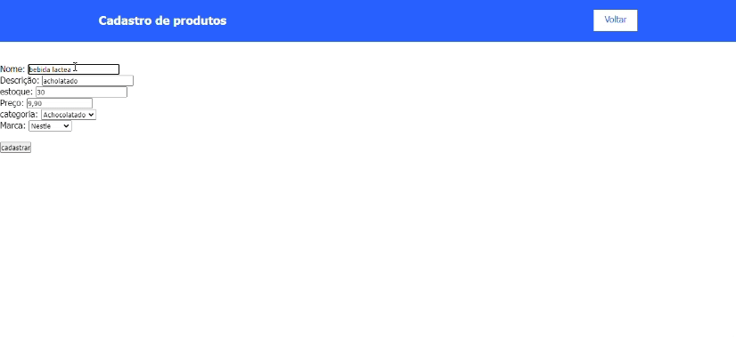

## Metodos Utilizados

Neste projeto utilizamos metodos PHP como:
* include:
Inclui o arquivo especificado cada vez que é chamado.
Gera um aviso (warning) em caso de erro, mas continua a execução.
* include_once:
Inclui o arquivo especificado apenas uma vez, mesmo que seja chamado múltiplas vezes.
Gera um aviso (warning) em caso de erro, mas continua a execução.
* require_once:
Funciona como include_once, mas gera um erro fatal em caso de erro e interrompe a execução do script
# Require_once
O require_once é uma função para incluir arquivos que devem estar presentes uma única vez na execução do script.Se o arquivo não puder ser incluído (por exemplo, se ele não existir), o script gera um erro fatal e para a execução.E no projeto utilizamos ele nas funções: Index.PHP, Pedido.PHP, Carrinho.PHP, Produtos-busca.PHP,PDTS.pedido,PDTS.resumo.
 # Exemplos
 * Esta no arquivo pedido.php.
 O código <?php require_once('controller/produtos-busca.php'); ?> 
 inclui e avalia o arquivo produtos-busca.php localizado no diretório controller durante a execução do script PHP. 
 * Esta no arquivo carrinhho-remover.php.
require_once('../model/Carrinho.class.php');
Inclui a definição da classe Produtos a partir do arquivo Produtos.class.php localizado no diretório model.
Cria uma nova instância da classe Produtos.
Chama o método buscar da instância criada.

# Include_once
Quando você usa include_once, o PHP verifica se o arquivo já foi incluído anteriormente no script. Se já foi, ele não será incluído novamente. Isso é útil para evitar problemas de redefinição de funções, classes ou variáveis que podem ocorrer se o mesmo arquivo for incluído mais de uma vez.E utilizamos ele nos seguintes arquivos: Categoria.PHP, Insere-produto.PHP, Marcas.PHP, Produtos.PHP.
# Exemplos
include_once('controller/conexao.php');
Esse código PHP é responsável por criar uma página de cadastro de produtos.
include_once('controller/conexao.php'); busca e inclui o arquivo conexao.php localizado no diretório controller.

# Inclue
* Exemplo para explicar foi no  codigo do arquivo insere-categoria.php
include('arquivo.php'); busca e inclui o conteúdo do arquivo arquivo.php no ponto onde a função include é chamada.Se o arquivo especificado não puder ser incluído (por exemplo, se ele não existir ou houver um erro de permissão), o PHP gera um aviso (warning), mas continua a execução do script.

if ($mysqli->connect_error)
# die ('Connect Error');
* isto esta no arquivo conexão.php
Este código PHP estabelece uma conexão com um banco de dados MySQL
Esta condição verifica se houve algum erro ao tentar conectar ao banco de dados.
connect_error contém a descrição do erro se houver falha na conexão.
Se houver um erro, o script é encerrado com a mensagem 'Connect Error'.

## Funsonalidades
Este projeto tem como primeira funcionalidade a opição de cadastrar o produto onde o usuario preenchera os campos de acordo com o produto e marca preço e logo apos ele enviara uma mensagem falando cadastrado com sucesso e ira para o banco de dados.

